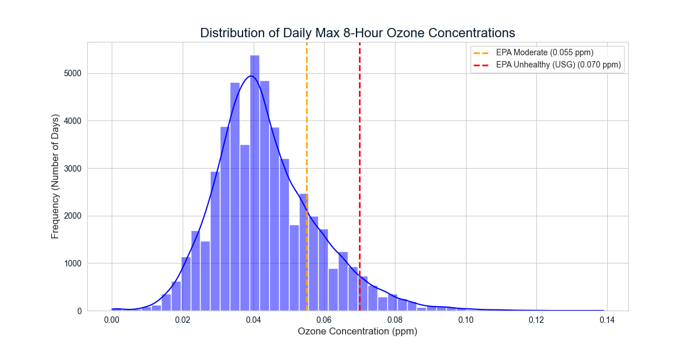
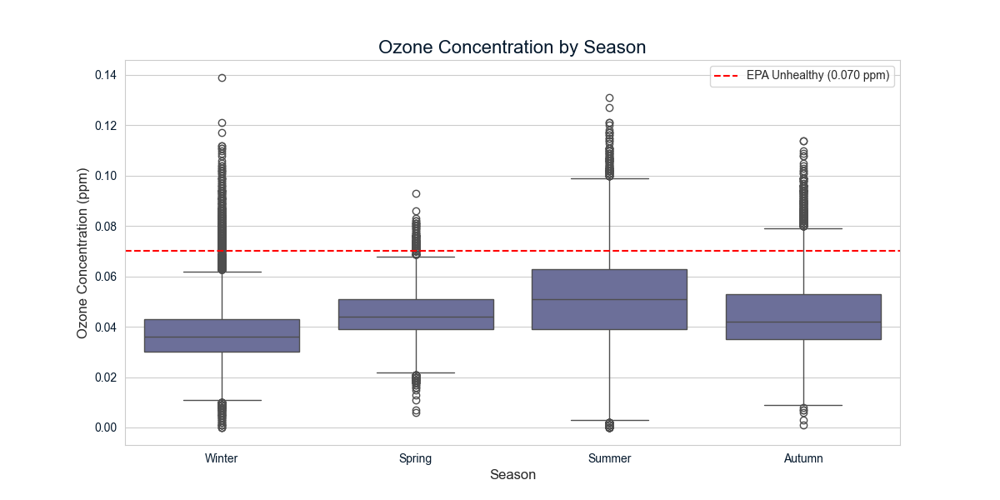
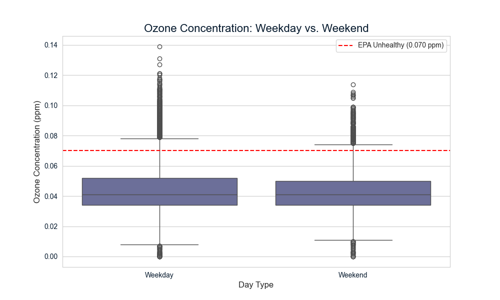
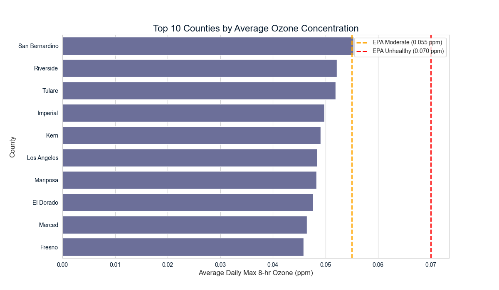
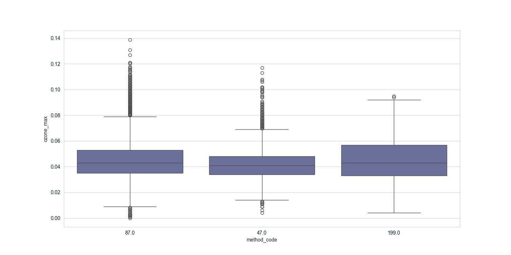

# California Ozone Analysis: A Data-Driven Analysis

California Air Quality Monitoring

This project analyzes a 54k-row EPA dataset to identify ozone pollution drivers. We cleaned and validated 95% of the data, then used `pandas`, `seaborn`, and `folium` to find hotspots.

**View the complete project notebook:** [`notebook.ipynb`](./notebook.ipynb)

---

## Interactive Geospatial Heatmap

The primary finding is the geographic concentration of pollution. The interactive map visualizes the hotspots (red/orange) and clean zones (blue/green) across California.

**[Click here to view the full-screen interactive heatmap](https://syafiraalatika.github.io/ca-ozone-analysis/ozone_heatmap_with_basemap.html)**

---

## Project Overview

### 1. Problem Statement
The goal was to evaluate ozone pollution in California using a raw EPA dataset. The data was unusable due to thousands of missing values, inconsistent date formats, and outliers, making it impossible to accurately identify high-risk regions or assess policy needs. The challenge was to clean and validate this data to uncover reliable, actionable insights.

### 2. Methodology
1.  **Data Cleaning:** Standardized all column names. Parsed and converted the inconsistent `Date` column to a proper `datetime` format. Dropped all rows with missing critical data (`date` or `ozone_max`), resulting in a validated dataset of 52,021 records (95% retention).
2.  **Feature Engineering:** Extracted `month`, `season`, `day_of_week`, and `is_weekend` from the clean date column to enable temporal analysis.
3.  **In-Depth Analysis:** Used statistical summaries and visualizations (boxplots, bar charts) to answer the key questions about when and where pollution occurs, and if monitoring methods were consistent.
4.  **Geospatial Visualization:** Aggregated data by monitoring site and plotted it on an interactive `folium` heatmap to visually identify pollution hotspots.

### 3. Key Findings
* **Geospatial:** Pollution is not a statewide problem. It is hyper-concentrated in two hotspots: **Southern California** (San Bernardino, Riverside) and the **Central Valley** (Tulare, Kern). Coastal areas remain consistently clean.
* **Temporal:** Pollution is overwhelmingly a **seasonal, summer phenomenon**, with average concentrations 36.6% higher than in winter.
* **Data Integrity:** A systemic discrepancy was found between monitoring methods, with `Method Code 199.0` consistently **under-reporting** ozone levels.

---

## Key Visualizations

This section includes the static plots that support our findings.

### 1. The "What": Distribution of Ozone
Most days are "Good," but a long tail of severe "Unhealthy" days drives the problem.


### 2. The "When": Seasonal & Weekly Trends
Pollution is overwhelmingly a summer problem and is measurably higher on weekdays.



### 3. The "Where": Top 10 Hotspots
Pollution is concentrated in specific counties, as shown by the bar chart.


### 4. The "How": Data Integrity
We found systemic differences between monitoring methods.


---

## Business Recommendations

Our analysis leads to a clear, three-part strategy:

#### I. Public Health & Policy Interventions
* **Focus on Regional Hotspots:** Prioritize all funding, policy interventions, and public health alerts in the identified high-risk counties (San Bernardino, Riverside, Tulare).
* **Implement "Smart" Alerts:** Launch public awareness campaigns that activate during the high-risk "ozone season" (May-September) and focus on high-heat weekdays.

#### II. Monitoring & Data Integrity
* **Standardize All Monitoring Methods:** Launch an immediate audit of data collection protocols to standardize calibration procedures, especially for `Method Code 199.0`.

#### III. Future Work
* **Build a Predictive Warning System:** Integrate this EPA data with meteorological data (temperature, wind) to build a machine learning model that can forecast high-pollution days in advance.

---

## Installation & Usage

Usage
1. Clone this repository: git clone [https://github.com/syafiraalatika/ca-ozone-analysis.git](https://github.com/syafiraalatika/ca-ozone-analysis.git)
2. Navigate to the directory: cd ca-ozone-analysis
3. Open the notebook-revised.ipynb file in a Jupyter environment (like Jupyter Lab, VS Code, or Google Colab).
4. Run the cells from top to bottom. The ozone.csv dataset is included in the repository.

### Installation

To run this analysis yourself, you will need the following libraries:
* `pandas`
* `numpy`
* `matplotlib`
* `seaborn`
* `folium`

You can install them using pip:
```bash
pip install pandas numpy matplotlib seaborn folium
